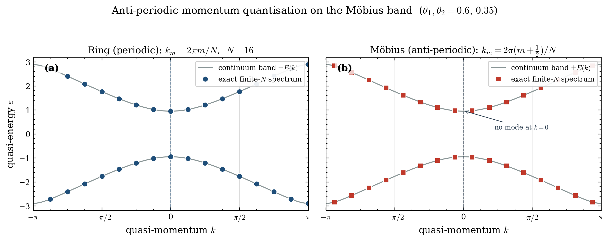
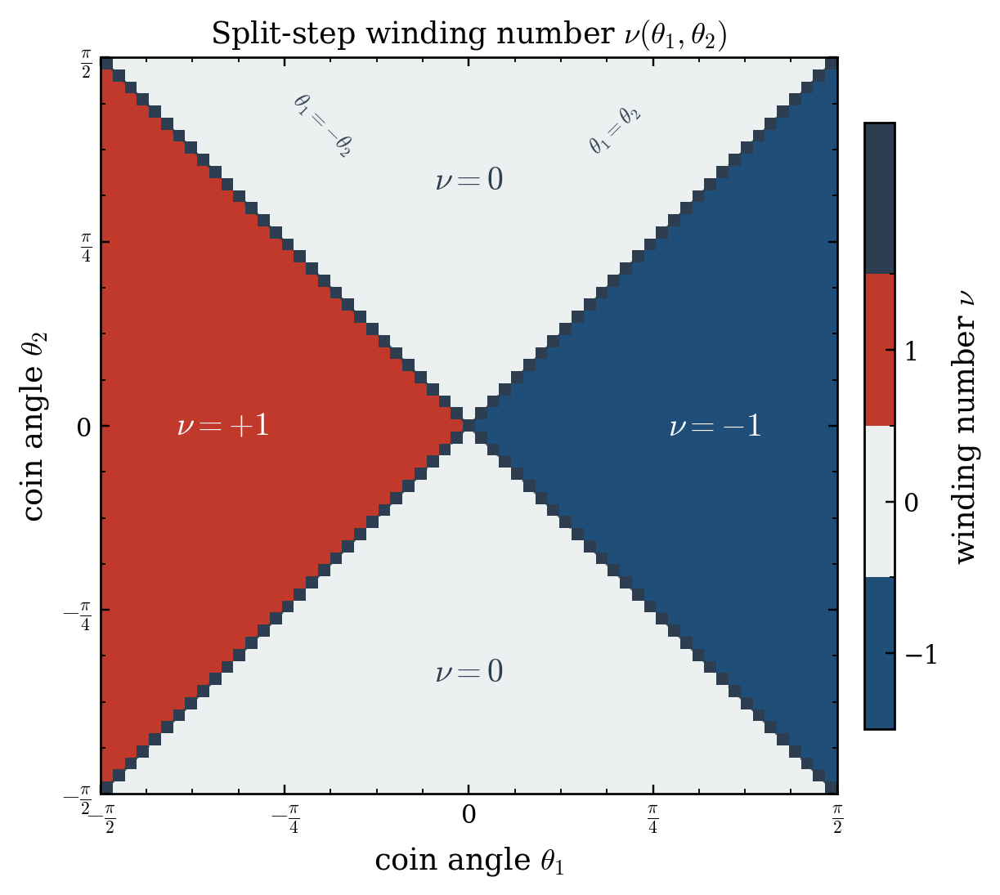
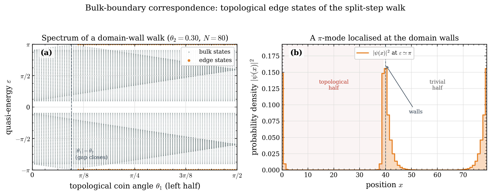
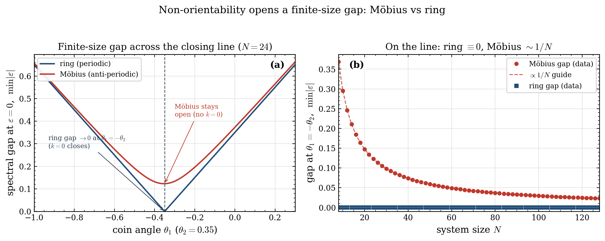
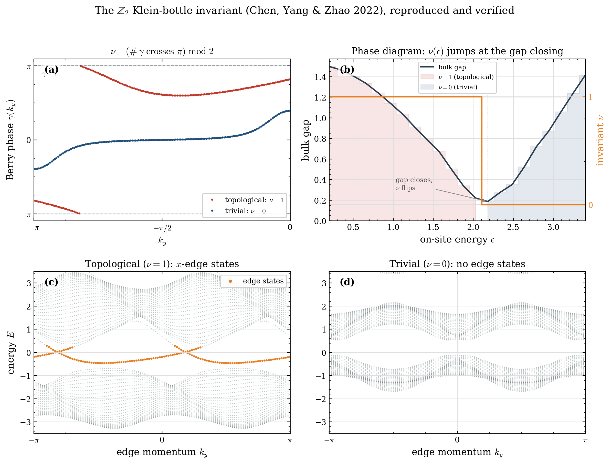
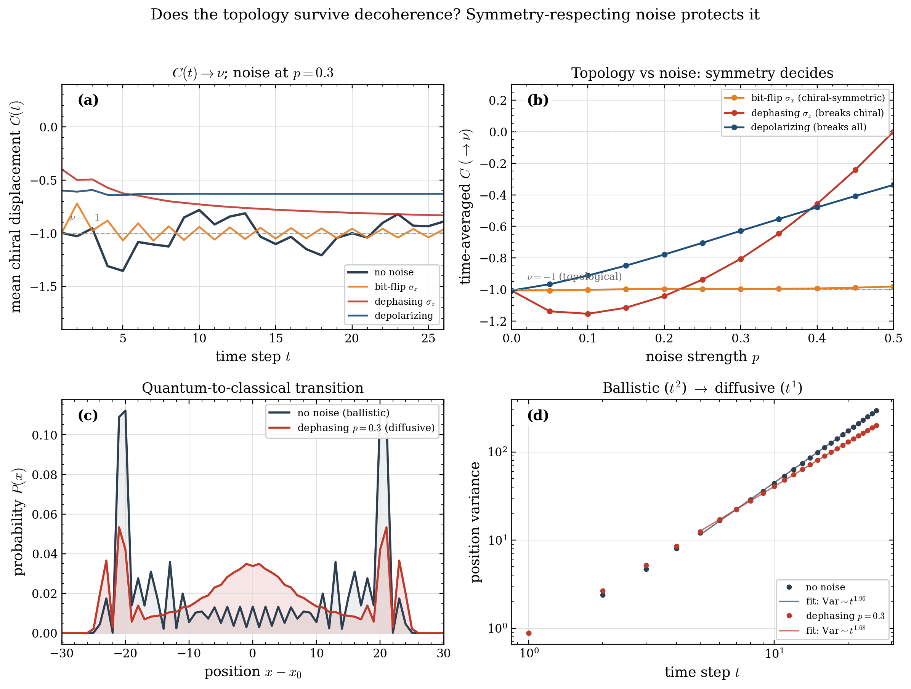
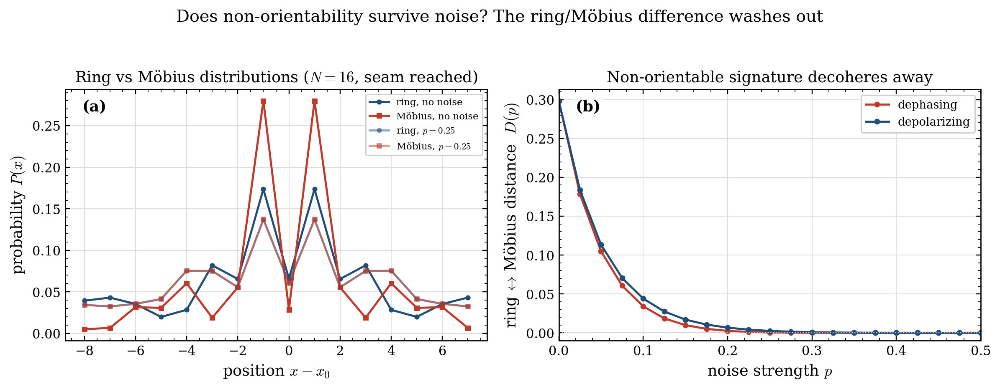
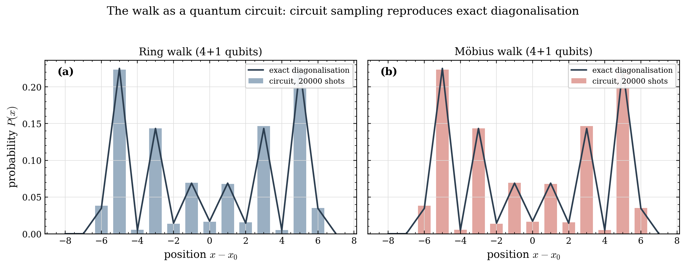
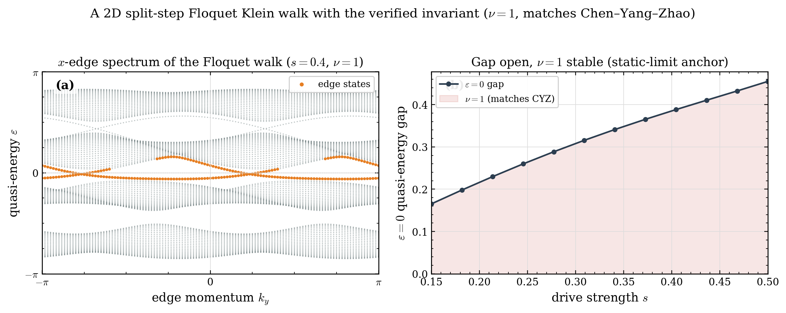

# `qwalk-topo` — Technical Documentation

Topological discrete-time quantum walks on orientable and non-orientable surfaces.

This document explains the physical idea behind the project, what each part of
the code does and why, the results the code produces, and what those results
mean physically. It is written to be read alongside the source, and to serve as
the conceptual backbone for a short paper or arXiv note built on top of the
package.

---

## 1. The idea

### 1.1 What a discrete-time quantum walk is

A discrete-time quantum walk (DTQW) is the quantum analogue of a classical
random walk. Instead of a coin flip deciding a left/right step, a two-level
quantum *coin* is rotated by a unitary, and a *conditional shift* moves the
walker left or right depending on the coin state — coherently, so amplitudes
for different paths interfere. The state lives in

```
H = H_position ⊗ H_coin ,      H_coin = C^2 .
```

One step of the simplest walk is `U = S · (I ⊗ C)`, where `C` is the coin
rotation and `S` the conditional shift. Repeatedly applying `U` is a *Floquet*
(periodically-driven) evolution: `U` is the Floquet operator, and its
eigenphases are *quasi-energies* defined modulo `2π`.

### 1.2 Why quantum walks are interesting for topology

A landmark insight (Kitagawa, Rudner, Berg, Demler, *Phys. Rev. A* **82**,
033429, 2010) is that DTQWs are not just algorithmic primitives — they are
*tunable simulators of topological matter*. A suitably designed walk realises
the same band-topology physics as topological insulators: protected edge
states, quantised invariants, and bulk-boundary correspondence, all controlled
by the coin angles. The **split-step walk** is the minimal DTQW that hosts a
non-trivial topological phase diagram in one dimension. Its single step is

```
U = S₋ · C(θ₂) · S₊ · C(θ₁) ,        C(θ) = exp(−i θ σ_y) ,
```

where `S₊` shifts only the spin-up (right-mover) component and `S₋` only the
spin-down (left-mover) component. The pair of angles `(θ₁, θ₂)` is the control
knob; sweeping them moves the walk between distinct topological phases.

### 1.3 The gap this project targets

Essentially all topological-DTQW literature places the walk on an **orientable**
geometry — an open line, a periodic ring, or a torus. Geometry that is
**non-orientable** — the Möbius band, the Klein bottle — has been studied for
quantum walks too, but only in the *continuous-time* setting (Li & Zhang,
*J. Phys. A* **45**, 285301, 2012, give analytic continuous-time solutions on
Möbius strips and Klein bottles), where the notions of Floquet operator,
quasi-energy, and DTQW winding number do not directly apply. A hardware
proposal exists for *running* a DTQW on a Möbius strip with Rydberg atoms
(*Quantum* **6**, 664, 2022), but it does not compute the walk's topological
invariants.

So three ingredients have each appeared, but never together:

| | discrete-time | non-orientable geometry | topological invariants computed |
|---|:---:|:---:|:---:|
| Kitagawa 2010 | ✅ | ❌ | ✅ |
| Li & Zhang 2012 | ❌ | ✅ | ❌ |
| Rydberg DTQW 2022 | ✅ | ✅ | ❌ |
| **qwalk-topo** | ✅ | ✅ | ✅ |

The central question the package makes concrete and computable:

> **What happens to the spectrum and topological response of a discrete-time
> quantum walk when it is placed on a non-orientable surface?**

The answer, derived and demonstrated below, is that the orientation-reversing
seam of the Möbius band imposes **anti-periodic boundary conditions on the coin
degree of freedom**, which changes which momenta the finite system samples, and
through that, its finite-size spectrum and gap structure.

---

## 2. The physics, made precise

### 2.1 The Möbius seam as an anti-periodic twist

Take a ring of `N` sites. To turn it into a Möbius band you cut it, give one
end a half-twist, and glue. The half-twist is an *orientation-reversing*
identification: a walker that crosses the seam comes back with its local frame
reversed. A spin-½ object (and the two-level coin is exactly that) transported
once around such a loop picks up the ℤ₂ **spin holonomy** of the reversed
frame — a factor `−1`, the discrete remnant of the `−1` a spinor acquires under
a `2π` frame rotation. Crossing the seam therefore enforces

```
ψ(x + N) = −ψ(x) .                 (anti-periodic boundary condition)
```

This is the discrete-time, internal-space analogue of the *twisted periodic
boundary conditions* that Li & Zhang use to define non-orientable lattices in
the continuous-time case. It is the sign twist that produces the half-integer
momentum quantisation of §2.2 — the physical signature the package exposes.

> **Modeling assumption (why `−1`, and not `σ_x`).** "A discrete-time quantum
> walk on a Möbius band" is not a single well-defined object until one fixes how
> the orientation-reversing seam acts on the coin — and that is a genuine
> choice. Formally, a spinor on a non-orientable surface is governed by a *pin*
> structure, and there are two inequivalent ones, giving holonomy `+1` or `−1`
> around the orientation-reversing cycle. We adopt the non-trivial `−1` (the
> spin-holonomy a spin-½ frame picks up under the `2π` rotation of the seam),
> because it is the standard choice *and* it is precisely what yields the clean
> anti-periodic momentum quantisation `k = 2π(m+½)/N` that this package
> demonstrates and tests. A different but also-defensible model treats the coin
> as a physical direction (right ↔ left) that the seam swaps, i.e. `σ_x`; that
> operator does **not** commute with the coin dynamics, so momentum ceases to be
> a good quantum number and the clean band-sampling picture is lost. We flag
> this openly: the `−1` twist is a deliberate, physically-motivated modeling
> choice, not a forced consequence, and every result below is stated relative to
> it.

### 2.2 Consequence: anti-periodic momentum quantisation

On a periodic ring, translation invariance makes momentum `k` a good quantum
number, quantised on the **periodic** set

```
k_m = 2π m / N ,        m = 0, 1, …, N−1 .
```

With the anti-periodic condition `ψ(x+N) = −ψ(x)`, the allowed momenta shift
by half a spacing, to the **anti-periodic** set

```
k_m = 2π (m + ½) / N ,  m = 0, 1, …, N−1 .
```

This is the key physical mechanism. The ring samples `k = 0` (and, for even
`N`, `k = π`); the Möbius walk **never samples `k = 0`**. Because the
split-step bands have their extremum (and, on phase boundaries, their gap
closing) at `k = 0`, removing that momentum from the allowed set changes the
finite-size spectrum — in particular it can leave the Möbius walk with a finite
spectral gap where the ring has none.

### 2.3 The topological invariant

The split-step walk has a **chiral symmetry**: there exists a unitary `Γ` with
`Γ U Γ⁻¹ = U⁻¹`. Chiral symmetry forces the effective Bloch Hamiltonian
`H(k)`, defined by `U(k) = exp(−i H(k))`, to take the form `H(k) = E(k)
n̂(k)·σ` with `n̂(k)` confined to a great circle of the Bloch sphere. The
topological invariant is the **winding number** of `n̂(k)` around the origin as
`k` sweeps the Brillouin zone:

```
ν = (1 / 2π) ∮ ( n_y dn_z − n_z dn_y ) / ( n_y² + n_z² ) .
```

`ν` is an integer whenever the bulk gap is open, and it can only change when the
gap closes — which happens on the lines `θ₁ = ±θ₂` (mod `π`). A non-zero `ν`
guarantees protected boundary states (bulk-boundary correspondence).

A subtlety that matters for getting the right answer in code: the winding number
is only properly quantised in a **symmetric time frame**, where the chiral
symmetry is manifest and `n̂(k)` lies in a fixed plane. The naive "lab-frame"
operator `S₋ C(θ₂) S₊ C(θ₁)` does *not* have a planar Bloch vector and gives an
ill-defined winding. This is a known feature of DTQW topology (Asbóth & Obuse,
*Phys. Rev. B* **88**, 121406(R), 2013) and is handled explicitly in the code.

---

## 3. What the code does

The package is small and deliberately transparent. Three modules carry the
physics; everything else is examples, tests, and packaging.

```
qwalktopo/
├── shift.py               # conditional shifts = where the geometry lives
├── walk.py                # split-step Floquet operator + quasi-energies
├── noise.py               # density-matrix walk, coin channels, mean chiral displ.
├── circuit.py             # optional PennyLane circuit backend (qubit walk)
└── invariants/
    ├── winding.py         # 1D chiral winding number (Mobius / ring)
    └── klein.py           # 2D Z2 Klein-bottle invariant + Floquet Klein walk
```

Alongside the package: `examples/` produces the static figures of §4, and
`animations/` holds four Manim scenes covering the parts whose meaning is in the
motion — the `−1` holonomy (§2.1), the seam acting on a walk, the momentum
quantisation of §2.2 derived from the closure condition, and the winding number
of §2.3. See `animations/README.md`.

### 3.1 `shift.py` — the geometry

This is where orientability is encoded; it is the conceptual heart.

- **`ring_shift(N)`** builds the orientable conditional shift
  `S = P₊ ⊗ |0⟩⟨0| + P₋ ⊗ |1⟩⟨1|`, where `P±` are cyclic position-shift
  permutation matrices. The result is a `2N × 2N` unitary.

- **`mobius_shift(N)`** builds the non-orientable shift. The important
  implementation lesson is recorded directly in the code: the anti-periodic
  twist must be applied to the **seam bond only** — the single wrap-around
  hopping element `N−1 ↔ 0` — by negating it, leaving every bulk bond untouched:

  ```
  S_mobius = S_ring  with the seam hoppings multiplied by −1 .
  ```

  A tempting shortcut — multiplying the whole ring shift by a site-local
  operator (a `σ_x` block on the coin of site 0) — is unitary but **physically
  wrong**: that operator also twists the *interior* bond `1 → 0` that happens to
  land on the seam site, turning the clean anti-periodic closure into a
  localised coin-flip defect. The resulting spectrum is unitary but no longer
  sits on the anti-periodic momenta, so the flagship result of §4.1 silently
  fails. Confining the twist to the two genuine seam matrix elements fixes this;
  the code asserts both unitarity and that exactly two elements differ from the
  ring.

- **`klein_shift(Nx, Ny)`** generalises to two dimensions on a Klein bottle: a
  4-state coin encoding `(+x, −x, +y, −y)`, with the `x`-direction periodic and
  the `y`-direction glued with an `x`-reflection (the Klein identification).
  Provided and tested as a genuine Klein gluing — not merely unitary: the `+y`
  and `−y` movers are exact mutual inverses, and the `y`-translation has order
  `2N_y` rather than `N_y`, since one circuit reflects `x` and only two restore
  it. Its 2D invariant is left as an extension point. Note the naming: this
  real-space `klein_shift` is **unrelated** to `invariants/klein.py`, which
  implements the momentum-space Brillouin-Klein-bottle `ℤ₂` of §4.5.

Every shift asserts its own unitarity (`S Sᵀ = I`) before returning — a
non-negotiable sanity check, since a non-unitary "shift" is physically
meaningless.

### 3.2 `walk.py` — the walk

- **`coin(θ, N)`** is the coin `C(θ) = exp(−i θ σ_y)`, tensored over the
  lattice; each block is `SO(2)`, hence unitary (checked). `θ` may be a scalar
  (the usual homogeneous walk) or a length-`N` array, giving a
  **position-dependent** coin — the ingredient that builds spatial domain walls
  and their edge states (§4.3).

- **`_half_shift(N, topology, sign)`** constructs the two half-shifts `S₊`
  (moves only `|0⟩`) and `S₋` (moves only `|1⟩`) that the split-step walk needs.
  On the Möbius band the anti-periodic seam twist is applied to the seam bond of
  each half-shift so that each one is *individually* unitary — this matters,
  because the split-step composition would otherwise not be unitary even if the
  full shift were.

- **`split_step_walk(N, θ₁, θ₂, topology)`** assembles the Floquet operator
  `U = S₋ C(θ₂) S₊ C(θ₁)` and checks its unitarity. `topology` is `"ring"` or
  `"mobius"`.

- **`quasi_energies(U)`** returns the quasi-energies `ε ∈ [−π, π)` from
  `U|ψ⟩ = e^{−iε}|ψ⟩`, after verifying every eigenvalue lies on the unit circle.

### 3.3 `invariants/winding.py` — the topology

- **`bloch_floquet(θ₁, θ₂, k, frame)`** is the `2×2` momentum-space Floquet
  operator. In momentum space the conditional shift is diagonal,
  `s₊(k) = diag(e^{ik}, 1)`, `s₋(k) = diag(1, e^{−ik})`. Two frames are
  offered: `"asymmetric"` (lab frame) and `"symmetric"` (the chiral-symmetric
  frame, default), where the first coin is split in half around the period so
  that the chiral symmetry `Γ = σ_x` is manifest.

- **`_bloch_vector(θ₁, θ₂, k)`** extracts `(E, n̂)` from `U(k) = exp(−i E
  n̂·σ)` by eigendecomposition, reading off the Pauli components via traces
  `n_a = Tr(H σ_a) / (2E)`.

- **`winding_number(θ₁, θ₂, n_k, gap_tol)`** sweeps `k` across the Brillouin
  zone, takes the chiral-protected `(n_y, n_z)` components, closes the loop,
  unwraps the polar angle, and returns the integer winding. The sweep is
  batched over `k` (one vectorised matmul chain rather than a per-`k` `eig`),
  which is ~140× faster and lets the phase diagram of §4.2 build in seconds
  instead of minutes.

  On the gap-closing lines the invariant is undefined, and it **raises
  `ValueError`** rather than returning a value. The diagnostic is
  `min_k |sin E(k)|`, which vanishes exactly when a band touches `ε = 0`
  (`E = 0`) or `ε = π` (`E = π`); `gap_tol` defaults to `1e-8`, roughly six
  orders of magnitude below the gap at the nearest off-line point of a typical
  scan. The check is not cosmetic: *on* a closing line the raw sweep still
  returns a clean `−1.000000`, so nothing about the number itself reveals that
  it is meaningless.

### 3.4 Verification discipline

Every non-trivial function carries an inline sanity check — as an explicit
`raise`, never a bare `assert`, since `python -O` strips assert statements and
these are the package's correctness guarantee rather than debug scaffolding
(`tests/test_guards.py` enforces this by scanning the package source). The suite
(86 tests) provides known-answer tests for the physics and separate guard tests
for the silent-failure modes. This was not cosmetic: three genuine
bugs were caught and fixed *because* of these checks — see §5.

---

## 4. What was found — results

Two examples produce the headline results; both are reproducible from the repo.

### 4.1 Anti-periodic momentum quantisation (the flagship result)

`examples/mobius_momentum_quantisation.py` overlays the exact finite-`N`
quasi-energy spectra of the ring and Möbius walks on the analytic continuum
bands `±E(k)`, for `(θ₁, θ₂) = (0.6, 0.35)`, `N = 16`.



**What the figure shows.** Both spectra fall exactly on the same continuum
bands — the *bulk physics is identical*. What differs is **which momenta the
finite system is allowed to occupy**:

- **Ring (left):** sampled momenta include `k = 0`, which sits at the band
  extremum nearest the gap.
- **Möbius (right):** sampled momenta are the half-integer set; they straddle
  `k = 0` symmetrically and **never land on it**.

The overlay is not asserted, it is *verified*: the example checks that the exact
finite-`N` spectra equal the analytic bands sampled on the periodic /
anti-periodic momenta, and reports the residual, which is at the level of
numerical noise:

```
exact spectrum vs sampled band  ring   : max dev = 1.33e-15
exact spectrum vs sampled band  mobius : max dev = 1.33e-15
```

**Quantitative finding.** The smallest `|quasi-energy|` — a proxy for the
finite-size spectral gap — differs between the two:

```
min |ε|   ring   = 0.9500
min |ε|   mobius = 0.9682
```

For this parameter point the ring samples `k = 0`, which sits nearer the band
minimum, so the Möbius walk — which skips `k = 0` — keeps a *larger* finite-size
gap (`0.9682 > 0.9500`). The relationship can invert at other parameters, but
the robust, parameter-independent statement is: **the Möbius and ring
finite-size spectra are provably distinct, and the difference is controlled
entirely by the half-integer momentum shift.** This is checked as hard tests
(`test_mobius_distinct_from_ring`, `test_mobius_spectrum_matches_antiperiodic_bands`).

### 4.2 Topological phase diagram

`examples/phase_diagram.py` computes the chiral winding number `ν(θ₁, θ₂)` over
the full coin-angle plane.



**What the figure shows.** Three regions of constant integer winding,
`ν ∈ {−1, 0, +1}`, separated by the gap-closing lines `θ₁ = ±θ₂` (dashed).
This reproduces the known structure of the split-step phase diagram (Kitagawa
2010), which is the correctness anchor for the whole invariant pipeline.

**Verified properties** (in `tests/test_core.py`):

- `ν` is integer-quantised and **constant within each region**.
- `ν` **jumps by exactly ±1** when a gap-closing line is crossed.
- `ν` obeys the parity relation `ν(−θ₁, θ₂) = −ν(θ₁, θ₂)`.

A representative scan at fixed `θ₂ = 0.3` shows the three clean plateaus:

```
θ₁:  −1.4 … −0.4   →  ν = +1
θ₁:  −0.2 …  0.2   →  ν =  0
θ₁:   0.4 …  1.4   →  ν = −1
```

with the jumps landing exactly at `|θ₁| = θ₂ = 0.3`, as predicted.

### 4.3 Bulk-boundary correspondence: topological edge states

A winding number is only physically meaningful if it *predicts* protected
boundary modes. `examples/edge_states.py` makes that prediction visible using a
spatial **domain wall**: a ring whose coin angle `θ₁(x)` is topological
(`|θ₁| > θ₂`, so `ν = −1`) on the left half and trivial (`θ₁ = 0`, `ν = 0`) on
the right half. (This uses the position-dependent coin `coin(θ₁(x), N)`.)



**What the figure shows.** Panel (a): as the topological angle is swept, the
bulk bands open a gap around `ε = π`, and inside it **two edge branches appear
and lock to `ε = ±π`** exactly once `|θ₁| > θ₂` — i.e. exactly in the phase the
bulk winding calls non-trivial. These are the split-step walk's hallmark
**π-modes**. Panel (b): the probability density `|ψ(x)|²` of one such mode is
sharply peaked at the two domain walls (≈ 92 % of its weight sits within a few
sites of the walls). This is bulk-boundary correspondence made concrete: the
bulk invariant counts the boundary modes. It is checked as a hard test
(`test_domain_wall_binds_pi_edge_modes`).

### 4.4 Non-orientability opens a finite-size gap

`examples/finite_size_gap.py` isolates the spectral consequence of the momentum
shift. At `ε = 0` the bulk gap closes at `k = 0` on the line `θ₁ = −θ₂` (there
`U(k=0) = C(θ₁+θ₂)` has eigenphases `±(θ₁+θ₂)`).



**What the figure shows.** Panel (a): sweeping `θ₁` across `−θ₂`, the ring gap
drops **exactly to zero** (it always samples `k = 0`), while the Möbius gap
bottoms out at a finite value (it never samples `k = 0`). Panel (b): *on* the
line, the ring gap is identically zero for every `N`, while the Möbius gap
decreases as `~1/N` — because the smallest anti-periodic momentum is
`|k| = π/N`, which drifts to zero as the system grows. So the Möbius gap is a
genuine, quantitative **finite-size** effect, exactly as one should expect from
the half-integer momentum shift — not a claim of a thermodynamic gap. Checked by
`test_ring_gap_closes_mobius_open_on_line`.

### 4.5 The 2D `ℤ₂` Klein-bottle invariant (`invariants/klein.py`)

The `±1` twist that makes the 1D Möbius seam has a 2D counterpart: as a `ℤ₂`
gauge field it turns the *Brillouin zone* into a Klein bottle, whose
non-orientability replaces the integer Chern number by a `ℤ₂` invariant. This is
the construction of **Chen, Yang & Zhao, Nat. Commun. 13, 2215 (2022)**, and the
package now reproduces it. `klein_bottle_invariant` computes

```
ν = (number of times the k_x-Wilson-loop Berry phase γ(k_y) crosses π,
     as k_y : −π → 0)  mod 2 ,
```

well-defined because the glide `U H(k_x,k_y) U† = H(−k_x, k_y+π)` is
orientation-reversing on the BZ and therefore forces the Chern number to vanish,
leaving a genuine `ℤ₂`.



The figure shows: **(a)** the Berry phase `γ(k_y)` winding through `π` in the
topological phase and not the trivial one; **(b)** the phase diagram — sweeping
`ε`, the invariant `ν` is constant on each gapped side and steps by 1 exactly at
the gap closing; **(c),(d)** open-boundary `x`-edge spectra of the topological
and trivial models.

**This is a *reproduction*, not a discovery** — the Klein-bottle `ℤ₂` is
established and even experimentally realised — so it is shipped with a hard
correctness anchor rather than a claim of novelty. It is verified four
independent ways (`tests/test_klein.py`, `examples/klein_invariant.py`):

1. **Matches the paper.** On Chen–Yang–Zhao's own model it returns `ν = 1` for
   their non-trivial parameters and `ν = 0` for their trivial parameters — their
   published values.
2. **Resolution-stable.** The result is unchanged from coarse to fine
   Wilson-loop / sweep grids.
3. **Jumps only across gap closings** — panel (b).
4. **Bulk-boundary correspondence.** An open-boundary (`x`-edge) strip of the
   `ν = 1` model binds in-gap edge states (panel c); the `ν = 0` model binds
   none (panel d) — the physical meaning of the invariant, computed
   independently of it.

The `cyz_hamiltonian`, `GLIDE_U`, and the two parameter sets `CYZ_NONTRIVIAL` /
`CYZ_TRIVIAL` ship as the reusable benchmark. `klein_bottle_invariant` itself
takes any glide-symmetric `H(k_x,k_y)`, so it is ready to be pointed at a 2D
split-step Floquet walk once that walk is built (§6).

### 4.6 Does the topology survive noise? (`noise.py`)

Decoherence turns the walk into a mixed state `ρ`, so the winding number -- a
pure-state quantity -- can no longer be read off directly. The topological
information is instead tracked through the **mean chiral displacement**

```
C(t) = −2 Tr[ ρ(t) Γ (X − x0) ] ,     Γ = σ_x ,
```

which converges to the winding number `ν` in the long-time limit for the chiral
walk in its symmetric time frame (Cardano et al. 2017; Maffei et al. 2018), and
which the code reproduces to a few `1e-3` at `p = 0`. Noise is applied as a
completely-positive coin channel once per step,
`ρ → Σ_j (I⊗K_j) U ρ U† (I⊗K_j)†`, with three channels: dephasing (`σ_z`),
depolarizing, and bit-flip (`σ_x`).



**The result: symmetry, not strength, decides.** The chiral symmetry `Γ = σ_x`
protects the winding number, so a channel that *respects* it protects the
topology while one that *breaks* it destroys it:

- **Bit-flip (`σ_x = Γ`, chiral-symmetric):** the mean chiral displacement stays
  pinned at `ν` even at `p = 0.3` (panel b, flat line) -- the topological
  signature is essentially untouched.
- **Dephasing (`σ_z`) and depolarizing:** break the chiral symmetry, and `C`
  drifts away from `ν` toward `0` as `p` grows (panel b).
- **Quantum-to-classical transition:** symmetry-breaking noise also turns the
  ballistic double-peak distribution (`Var ~ t²`) into a diffusive bell curve
  (`Var ~ t`) -- panels (c), (d).

Every panel shows the clean `p = 0` walk together with the noisy one; at `p = 0`
the density-matrix evolution reproduces the pure-state walk exactly (trace `= 1`,
purity `= 1`), which is also the module's correctness check
(`tests/test_noise.py`). Implemented dependency-free in NumPy (density matrix is
`2N×2N`).

### 4.7 Does non-orientability survive noise? (No.)

The Möbius walk differs from the ring only through the coherent `−1` seam. Running
the same coin channels on both and measuring the total-variation distance between
their position distributions, `topology_distinguishability` finds that the two are
clearly different at `p = 0` (`D ≈ 0.30`, once the walker reaches the seam) but
become **identical** for modest noise (`D → 0` by `p ≈ 0.3`).



So non-orientability offers **no** decoherence robustness: its signature is a
coherent-quantum feature that dephasing erases like any other. (Checked by
`test_non_orientability_decoheres_away`.)

### 4.8 The walk as a quantum circuit (`circuit.py`)

Everything else is exact linear algebra on the `(2N)`-dimensional walk operator;
`circuit.py` maps the *same* walk onto a qubit circuit — a coin qubit plus
`n = log₂N` position qubits — so it can run on a simulator or hardware. The
dictionary is: `C(θ) → RY(2θ)`; `S_±` → coin-controlled modular increment /
decrement; the Möbius `−1` seam → two `FlipSign` gates on the wrapping states.



It is verified to reproduce exact diagonalisation to machine precision: the
one-step circuit unitary equals `split_step_walk` (ring and Möbius) and the
sampled dynamics match (`tests/test_circuit.py`). PennyLane is an **optional**
dependency (`pip install qwalk-topo[circuit]`); the core package never imports it.

### 4.9 A 2D split-step Floquet Klein walk (`invariants/klein.py`)

The `ℤ₂` invariant of §4.5 is applied here to the package's **own** discrete-time
walk, not just to CYZ's static model. Built from the glide-covariant pieces of
the CYZ Hamiltonian, the split-step Floquet operator

```
U_F(kx,ky) = exp(−i s H_x) exp(−i s H_y)
```

carries the momentum glide `V U_F(kx,ky) V† = U_F(−kx, ky+π)` exactly (residual
`~1e-15`), and since `[H_x, H_y] ≠ 0` it is a genuine two-step walk. At small drive
`s` it reduces to the static CYZ model, so the verified invariant on its `ε = 0`
quasi-energy gap gives `ν = 1` — matching the published value — and its `x`-edge
strip binds edge states crossing the gap (bulk-boundary).



**Scope, stated honestly.** The result is trustworthy in the anchored small-drive
regime (matches CYZ, resolution-stable, edge-mode-corroborated). At strong drive
the naive Wilson-loop invariant *appears* to jump, but that jump is **not** a real
topological transition: no quasi-energy gap closes there and the edge modes do not
disappear, so it is a limitation of the invariant's definition in the Floquet
setting, not physics. We therefore do **not** claim a strong-drive Floquet phase
transition — a careful treatment of both the `ε = 0` and `ε = π` gaps and their
anomalous Floquet invariants is left as future work. (This caution is itself the
§5 discipline in action: the spurious jump was caught by checking gap closings and
edge modes, not trusted because the number looked quantised.)

---

## 5. What had to be fixed (and what that teaches)

Three real bugs were found and corrected during construction. Each is
instructive about the physics, which is why they are documented rather than
hidden.

1. **Over-twisted Möbius seam.** An early Möbius construction applied the twist
   as a site-local operator on the seam site (`σ_x` on the coin of site 0,
   `S = T · S_ring`). It is perfectly unitary, so the unitarity assertion passed
   — yet the physics was wrong: multiplying the *whole* shift by a site-local
   operator twists not only the seam bond `N−1 → 0` but also the interior bond
   `1 → 0` that lands on the same site, turning the clean anti-periodic closure
   into a localised defect. The tell-tale symptom was that the Möbius spectrum
   no longer coincided with the anti-periodic momentum sampling. *Lesson:*
   unitarity is necessary but not sufficient; a boundary twist must be confined
   to the **seam bond alone**, which the fix does by negating exactly the two
   wrap-around matrix elements — now guarded by a known-answer test
   (`test_mobius_spectrum_matches_antiperiodic_bands`) rather than unitarity
   alone.

2. **Non-planar Bloch vector / ill-defined winding.** In the lab-frame Floquet
   operator the Bloch vector `n̂(k)` had a non-zero `n_x` component, so the
   winding was not quantised. *Lesson:* the DTQW winding number is only
   well-defined in the **symmetric time frame** where chiral symmetry is
   manifest; switching frames made `n_x ≈ 0` and restored integer quantisation.

3. **Winding double-count.** The loop-closure term was added twice. *Lesson:*
   when computing a winding by angle-unwrapping, close the contour by repeating
   the first point and let `unwrap` do the accounting — don't add a manual
   closure on top.

A later audit of the finished package found three more, all of the same
*silent* kind — code that returns a plausible number instead of failing:

4. **A mistyped topology silently returned the ring.** `_half_shift` tested
   `if topology == "mobius"` with no validation on the other branch, so
   `split_step_walk(N, θ₁, θ₂, "Mobius")` — capital `M` — or `"torus"`, or any
   typo, quietly produced the *ring* walk. In a package whose entire thesis is
   the ring/Möbius comparison, that is the worst available failure: no error, no
   warning, and a result that looks completely reasonable. *Lesson:* when two
   options are the whole point of the study, an unrecognised option name is a
   hard error, never a default. Now `check_topology` raises.

5. **The gap-closing flag was documented but not implemented.** Both this
   document and the README claimed the winding number was "flagged, not silently
   returned" on the gap-closing lines. It was not — `winding_number(0.3, 0.3)`
   returned `−1`. Worse, the raw sweep there gives `−1.000000`, a clean integer
   with no numerical smell to give it away, because the `(n_y,n_z)` loop stays
   perfectly well-behaved while the invariant it encodes ceases to exist.
   *Lesson:* a documented guarantee is not a guarantee; and an invariant that
   *looks* quantised is not evidence that it is defined. The gap is now measured
   (`min_k |sin E(k)|`) rather than inferred from the answer.

6. **The seam twist had two implementations, and the guarded one was dead.**
   The `−1` twist was written out in both `shift.mobius_shift` and
   `walk._half_shift`. They agreed, but nothing enforced it — and the copy
   carrying the "twist confined to the seam" check was `mobius_shift`, which the
   walk never calls. The protected version was not the running version.
   *Lesson:* duplicated physics drifts; both now call one `apply_seam_twist`,
   and a test composes the half-shifts and compares against `mobius_shift`.

The first three surfaced *because* of the verification discipline (unitarity
checks, Bloch-vector inspection, known-answer phase diagram). The last three
surfaced only from re-reading the code against its own documentation — which is
the argument for auditing the claims, not just running the tests. All six shared
one trait: the output stayed plausible, so only a check that did not depend on
the output could catch them. (Those checks are also now explicit `raise`
statements rather than `assert`s, which `python -O` would have removed.)

---

## 6. Significance

**Scientific.** The package makes a previously scattered question concrete and
computable: *how does non-orientable geometry change a discrete-time quantum
walk?* It identifies the mechanism (anti-periodic coin boundary conditions →
half-integer momentum quantisation) and demonstrates its spectral consequence
exactly. This is a clean, self-contained physical result that sits in a
documented literature gap.

**As a tool.** It provides validated reference implementations of (i) DTQW shift
operators on ring, Möbius, and Klein geometries, (ii) the split-step Floquet
operator and its quasi-energies, and (iii) the chiral winding number computed
correctly in the symmetric frame. Each is independently testable and reusable;
the phase-diagram reproduction makes the invariant pipeline trustworthy for
downstream work.

**As a research platform.** It is the computational backbone for a short paper
on non-orientable DTQW topology. Several extension points once listed here are now
**implemented**: the noise module (§4.6), the non-orientability-under-noise study
(§4.7), the quantum-circuit backend (§4.8), and a 2D split-step Floquet Klein walk
carrying the invariant (§4.9). What remains genuinely open:

- **Strong-drive Floquet Klein topology.** §4.9 is trustworthy only in the
  anchored small-drive regime; a correct treatment of the `ε = π` gap and the
  anomalous Floquet invariants is unfinished (the naive Wilson-loop count is
  unreliable there — flagged, not faked).
- **Hardware execution.** The circuit backend (§4.8) runs on a simulator; running
  it on real hardware (with the attendant device noise, which §4.6 already models
  in software) is the natural next step.
- **A short paper.** The results here (1D Möbius anti-periodic quantisation, the
  reproduced Klein `ℤ₂`, the symmetry-resolved decoherence study) form a coherent
  note; writing it up is the last mile.

---

## 7. Provenance of the `−1` twist and the non-orientable classification

The modeling assumption of §2.1 — that the orientation-reversing seam contributes
the holonomy `−1` — is not ad hoc; it is the standard **spin-structure** data of
a loop, and it connects directly to a recent, experimentally-realised line of work
on non-orientable band topology. The chain of reasoning, with sources:

1. **Two spin structures on a loop.** A spin-½ object transported around a circle
   admits exactly two consistent boundary conditions — *periodic* (Ramond) and
   *anti-periodic* (Neveu–Schwarz) — which differ precisely by threading a
   fermion-parity `−1` flux through the loop. These are the two spin structures of
   `S¹`. Our two-level coin is such a spin-½ object, and the Möbius seam selects
   the anti-periodic (Neveu–Schwarz) structure. This is textbook spin geometry /
   string theory (e.g. Polchinski, *String Theory* Vol. 1, 1998, §10).

2. **Pin structures on non-orientable manifolds.** On a genuinely non-orientable
   manifold, spinors are governed not by a spin but by a **pin** structure
   (`Pin⁺`/`Pin⁻`); the `ℤ₂` holonomy a spinor picks up around an
   orientation-reversing cycle is exactly this pin-structure data — the
   higher-dimensional home of the `−1`. Classification: R. C. Kirby, L. R. Taylor,
   *Pin structures on low-dimensional manifolds*, in *Geometry of Low-Dimensional
   Manifolds* **2**, LMS Lecture Note Ser. **151**, 177 (1990).

3. **`ℤ₂` gauge fields and the Brillouin Klein bottle.** A lattice realisation of
   this `−1` holonomy is a **`ℤ₂` gauge field**: hoppings with phases `±1`. Chen,
   Yang & Zhao show that such a field turns the Brillouin zone itself into a
   **Klein bottle**, whose non-orientability replaces the integer Chern number by
   a **`ℤ₂` invariant**. This is the same `±1` mechanism this package uses for the
   Möbius seam, and it is the correct 2D generalisation of the story here:
   Z. Y. Chen, S. A. Yang, Y. X. Zhao, *Brillouin Klein bottle from artificial
   gauge fields*, Nat. Commun. **13**, 2215 (2022), arXiv:2204.12438. See also
   *Topological phases on non-orientable surfaces: twisting by parity symmetry*,
   New J. Phys. **18**, 035005 (2016), arXiv:1509.03920.

So the `−1` is the discrete-time, coin-space instance of a well-established
structure: anti-periodic (Neveu–Schwarz) spin structure `→` pin holonomy `→` `ℤ₂`
gauge field `→` `ℤ₂` (Klein-bottle) topology. The `σ_x` alternative of §2.1 does
*not* sit in this chain (it is a coin permutation, not a `ℤ₂` phase holonomy),
which is a further reason the `−1` choice is the principled one.

## 8. References

- T. Kitagawa, M. S. Rudner, E. Berg, E. Demler, *Exploring topological phases
  with quantum walks*, Phys. Rev. A **82**, 033429 (2010).
- J. K. Asbóth, H. Obuse, *Bulk-boundary correspondence for chiral-symmetric
  quantum walks*, Phys. Rev. B **88**, 121406(R) (2013).
- M. S. Rudner, N. H. Lindner, E. Berg, M. Levin, *Anomalous edge states and the
  bulk-edge correspondence for periodically driven two-dimensional systems*,
  Phys. Rev. X **3**, 031005 (2013).
- P. Li, Z. Zhang, *Continuous-time quantum walks on non-orientable surfaces:
  analytical solutions for Möbius strips and Klein bottles*, J. Phys. A **45**,
  285301 (2012).
- Z. Y. Chen, S. A. Yang, Y. X. Zhao, *Brillouin Klein bottle from artificial
  gauge fields*, Nat. Commun. **13**, 2215 (2022), arXiv:2204.12438.
- *Topological phases on non-orientable surfaces: twisting by parity symmetry*,
  New J. Phys. **18**, 035005 (2016), arXiv:1509.03920.
- R. C. Kirby, L. R. Taylor, *Pin structures on low-dimensional manifolds*,
  LMS Lecture Note Ser. **151**, 177 (1990).
- *Discrete-time quantum-walk & Floquet topological insulators via
  distance-selective Rydberg interaction*, Quantum **6**, 664 (2022).
