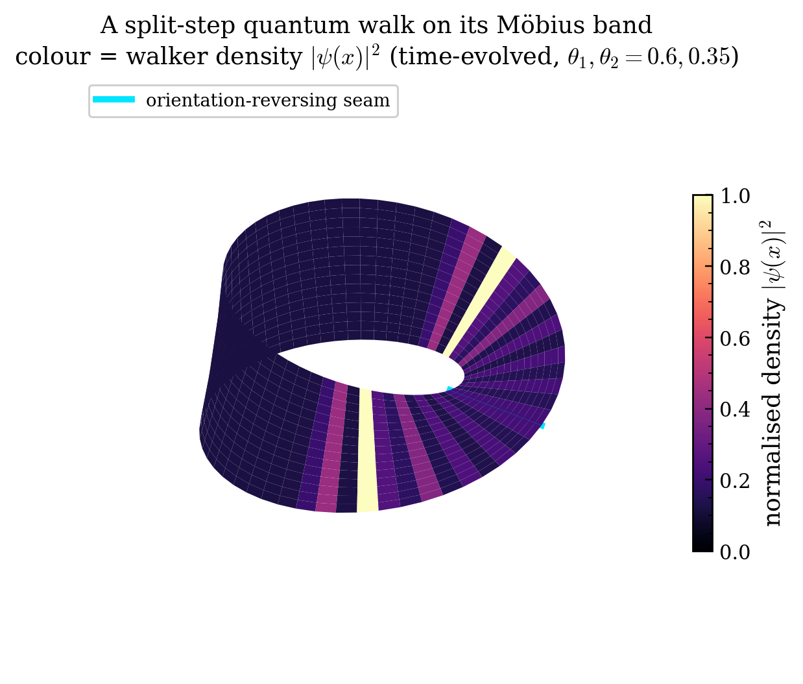
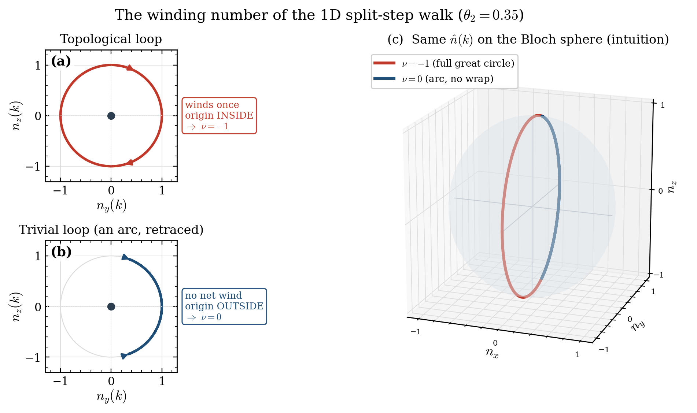

# qwalk-topo

[](https://github.com/shafin192002/qwalk-topo/actions/workflows/tests.yml)
[](https://www.python.org/downloads/)
[](LICENSE)
[](https://numpy.org/)

**Topological diagnostics for discrete-time quantum walks on orientable and non-orientable surfaces.**

`qwalk-topo` computes Floquet operators, quasi-energy spectra, and chiral
winding numbers for split-step discrete-time quantum walks (DTQWs) — including
walks on **non-orientable** surfaces (the Möbius band and Klein bottle), which
existing quantum-walk tooling does not handle.



*The 1D split-step walk drawn on its Möbius band: colour is the actual
time-evolved walker density `|ψ(x)|²`, and the cyan line is the
orientation-reversing seam (an illustration of the geometry — the quantitative
results are the figures further down).*

The non-orientable case is the point of the package. The orientation-reversing
seam of a Möbius band imposes **anti-periodic boundary conditions** on the coin
degree of freedom, shifting the allowed momenta from the periodic set
*k = 2πm/N* to the anti-periodic set *k = 2π(m+½)/N*. This changes the
finite-size spectrum and the topological response in ways that are absent from
the standard ring/torus walks studied in the literature.

---

## Why this exists (the gap)

| Setting | Discrete-time walk | Non-orientable geometry | Topological invariants |
|---|---|---|---|
| Kitagawa et al., PRA 82, 033429 (2010) | ✅ | ❌ (ring) | ✅ |
| Li & Zhang, J. Phys. A 45, 285301 (2012) | ❌ (continuous-time) | ✅ (Möbius/Klein) | ❌ |
| Rydberg DTQW, *Quantum* 6, 664 (2022) | ✅ | ✅ (hardware proposal) | ❌ (not computed) |
| **qwalk-topo** | ✅ | ✅ | ✅ |

The discrete-time **and** non-orientable **and** invariant-resolved combination
is, to our knowledge, not covered by an existing open tool.

*Read the last row as a property of the package, not of a single call.*
`winding_number` computes the **bulk** (Bloch) invariant of the split-step
family; the Möbius contribution is spectral — the anti-periodic momentum
quantisation of §"The walk" and the finite-size gap it opens — rather than a
separate non-orientable invariant. The `ℤ₂` of a non-orientable *Brillouin zone*
is the 2D Klein-bottle index, shipped here as a verified reproduction of Chen,
Yang & Zhao. See "Scope and limitations".

---

## Install

```bash
git clone https://github.com/shafin192002/qwalk-topo
cd qwalk-topo
pip install -e .              # core: NumPy + Matplotlib only
pip install -e .[circuit]     # optional: the PennyLane circuit backend
pip install -e .[animations]  # optional: Manim, to render animations/
```

Requires Python ≥ 3.10, NumPy, and Matplotlib. The circuit backend
(`qwalktopo.circuit`) additionally needs PennyLane. Rendering the animations
needs Manim Community — neither ffmpeg nor LaTeX is required.

---

## Quick start

```python
import numpy as np
from qwalktopo import split_step_walk, quasi_energies, winding_number

# Floquet operator of a split-step walk on a Möbius band
U = split_step_walk(N=16, theta1=0.6, theta2=0.35, topology="mobius")
eps = quasi_energies(U)            # quasi-energies in [-pi, pi)

# Bulk topological invariant (chiral winding number)
nu = winding_number(theta1=0.6, theta2=0.35)   # -> integer
```

---

## The walk

Hilbert space `H = H_pos ⊗ H_coin`, coin `C²`. The split-step Floquet operator is

$$U = S_- \thinspace C(\theta_2) \thinspace S_+ \thinspace C(\theta_1), \qquad C(\theta) = e^{-i\theta\sigma_y}$$

with conditional half-shifts `S_±`. On the ring the shift is periodic; on the
Möbius band the orientation-reversing seam contributes the ℤ₂ spin holonomy
`−1` to the coin wavefunction (a spin-½ frame transported once around a
non-orientable loop returns with a sign flip), implementing the gluing

$$\psi(x + N) = -\psi(x) \qquad \text{(anti-periodic boundary condition)}$$

realised by negating the **single seam bond** of the shift — the wrap-around
hopping `N−1 ↔ 0` — and leaving every bulk bond untouched. (Multiplying the
whole ring shift by a site-local `σ_x` is unitary but *wrong*: it also twists
the interior bond that lands on the seam site, turning the clean anti-periodic
closure into a localised defect and destroying the momentum quantisation
below.)

In the **symmetric time frame** the chiral symmetry `Γ = σ_x` is manifest, the
effective-Hamiltonian Bloch vector lies in the `(n_y, n_z)` plane, and the
winding number

$$\nu = \frac{1}{2\pi} \oint \frac{n_y  dn_z - n_z  dn_y}{n_y^2 + n_z^2}$$

is integer-quantised away from the gap-closing lines `θ₁ = ±θ₂`.

---

## Verified against known results

The test suite (`tests/`, 87 tests) checks:

- **Unitarity** of every shift and Floquet operator (ring, Möbius, Klein), and
  of the position-dependent coin.
- **Kitagawa phase diagram**: the winding number reproduces the three-region
  `(ν = −1, 0, +1)` structure separated by `θ₁ = ±θ₂` — see
  `examples/phase_diagram.py`.
- **Quantisation & plateaus**: `ν` is a constant integer within each region and
  jumps by ±1 across gap-closing lines.
- **Anti-periodic momentum quantisation**: the exact finite-`N` ring and Möbius
  spectra match the analytic bands sampled on the periodic / anti-periodic
  momenta respectively, to machine precision — and the Möbius spectrum is
  provably distinct from the ring at the same coin angles.
- **Finite-size gap**: on `θ₁ = −θ₂` the ring gap closes (`k=0`) while the
  Möbius gap stays open.
- **Bulk-boundary correspondence**: a topological/trivial domain wall binds
  exactly two `ε=π` edge modes, each localised at the walls.
- **Klein-bottle `ℤ₂`**: reproduces Chen–Yang–Zhao's published `ν = 1 / 0`,
  resolution-stable, and confirmed by `x`-edge modes (`tests/test_klein.py`).
- **Noise**: the density-matrix walk is trace-preserving/CPTP and reproduces the
  pure walk at `p=0` (MCD `→ ν`); symmetry-respecting noise protects the
  topological MCD while symmetry-breaking noise degrades it (`tests/test_noise.py`).
- **Floquet Klein walk**: the split-step Floquet operator satisfies the glide
  symmetry, and its invariant matches CYZ in the static limit (`tests/test_klein.py`).
- **Circuit backend**: the circuit unitary equals `split_step_walk` (ring and
  Möbius) and its sampled dynamics match, to machine precision (`tests/test_circuit.py`).
- **Guards** (`tests/test_guards.py`): the silent-failure modes, separately from
  the physics — an unknown `topology` raises instead of falling back to the ring,
  the seam twist has a single shared implementation (the half-shifts compose to
  `mobius_shift`), the winding number raises on gap-closing lines, the Klein `ℤ₂`
  rejects a non-glide-symmetric Hamiltonian, `klein_shift` is a genuine Klein
  gluing (its `y`-translation has order `2N_y`, not `N_y`), and no correctness
  check is a bare `assert` (which `python -O` would strip).

```bash
python -m pytest tests/ -v
```

---

## Examples

```bash
python examples/mobius_momentum_quantisation.py   # flagship: anti-periodic momenta
python examples/phase_diagram.py                  # topological phase diagram
python examples/edge_states.py                    # bulk-boundary edge states
python examples/finite_size_gap.py                # Möbius vs ring finite-size gap
python examples/winding_sphere.py                 # the winding number, visualised
python examples/mobius_render.py                  # 3D Möbius render (hero image)
python examples/klein_invariant.py                # 2D Z2 Klein-bottle invariant
python examples/klein_floquet_walk.py             # the Z2 walk (Floquet, glide)
python examples/noise_robustness.py               # does topology survive noise?
python examples/mobius_noise.py                   # does non-orientability survive noise?
python examples/circuit_backend.py                # the walk as a quantum circuit
```

**Anti-periodic momentum quantisation** — the exact finite-`N` ring and Möbius
spectra sit on the analytic bands, sampled at the periodic vs anti-periodic
(half-integer) momenta; the Möbius walk avoids `k = 0` (verified to ~1e-15).


**Topological phase diagram** — the chiral winding number `ν(θ₁,θ₂)`, three
regions `ν ∈ {−1, 0, +1}` split by the gap-closing lines `θ₁ = ±θ₂`.


**The winding number, visualised** — chiral symmetry pins `n̂(k)` to the
`(n_y,n_z)` plane, so it rides the **unit circle in both phases** and the two
curves are the same distance from the origin. What separates them is how far
around they get: a full lap for `ν=−1`, out-and-back for `ν=0`. (Net winding is
what "encircles the origin" counts; it is not something the loop's position on
the page shows.)



**Bulk-boundary correspondence** — a topological/trivial domain wall binds
protected `ε=π` edge modes, exponentially localised at the walls: the physical
meaning of a non-zero winding number.


**Non-orientability opens a finite-size gap** — on `θ₁ = −θ₂` the ring gap
closes at `k=0`, while the Möbius walk (which never samples `k=0`) keeps a gap
that closes only as `~1/N`.


**2D ℤ₂ Klein-bottle invariant** (reproducing Chen, Yang & Zhao 2022) — the
`±1` twist makes the Brillouin zone a Klein bottle with a `ℤ₂` invariant: the
Wilson-loop Berry phase winds through `π` in the topological phase (`ν=1`) but
not the trivial one (`ν=0`), and the topological model binds `x`-edge states.


**2D split-step Floquet Klein walk** — the package's own discrete-time walk,
built so its momentum-space Floquet operator carries the Klein glide
(`U(kx,ky) = V U(−kx,ky+π) V†`, verified to ~1e-15). The verified invariant on
its `ε=0` quasi-energy gap gives `ν=1`, matching CYZ, with edge modes crossing
the gap.


**Does the topology survive noise?** — evolving the walk as a density matrix
under coin decoherence, the mean chiral displacement (`→ ν`) shows that
*symmetry-respecting* noise (bit-flip `σ_x = Γ`) leaves the topology intact even
at strong `p`, while symmetry-breaking noise (dephasing, depolarizing) destroys
it and drives the ballistic quantum spreading toward classical diffusion.


**Does non-orientability survive noise?** — the ring↔Möbius distinguishability
decays to zero with modest noise: the non-orientable signature is a coherent
feature with no decoherence robustness.


**The walk as a quantum circuit** — mapped to a PennyLane circuit
(`n = log₂N` position qubits + a coin qubit); circuit sampling reproduces the
exact-diagonalisation distribution, for both ring and Möbius.


---

## Animations

Four [Manim](https://www.manim.community/) scenes, in [`animations/`](animations/),
for the parts of the physics whose meaning is in the *motion* and which a static
figure therefore cannot carry. The first three are one argument, in order.

### Why the seam twist is `−1`

A frame carried once around the band comes back **inverted**. That is the whole
justification for the `−1` in `mobius_shift` — a spin-½ coin transported around
an orientation-reversing loop returns negated.

https://github.com/user-attachments/assets/0eb67749-f896-4622-9b45-b53c75f0749e

### What the twist does

Ring and Möbius walks from the same start, drawn as *signed* amplitudes. All 32
components agree to the last bit until step 8, when exactly **one flips sign** —
`+0.0923` against `−0.0923` — and that lone sign then interferes outward until
the two walks differ everywhere.

(Signed, not `|ψ|²`: the seam's effect is a factor `−1`, and a density cannot
see a sign, since `|−a|² = |+a|²`. At the moment of crossing the two densities
are *identical*.)

https://github.com/user-attachments/assets/02e74ab8-7ab3-43d4-ac48-cb2f4c90c97e

### What it costs you

A wave must meet itself after one lap. On the ring it must return **as it left**;
on the Möbius band it must return **upside down**. Sweeping `k` and keeping only
the waves that close up gives `k = 2πm/N` against `k = 2π(m+½)/N` — the
half-step shift, derived from nothing but the closure condition.

And the flat wave? It would have to equal minus itself, so it cannot exist at
all. That is `k = 0`, exactly where the gap closes — which is why the Möbius
walk keeps a gap the ring loses.

https://github.com/user-attachments/assets/7de731dc-2306-4d55-a3eb-9a7855cce0e2

### The winding number

The chiral Bloch vector sweeping the Brillouin zone, with the accumulated angle
read off live: a full lap for `ν = −1`, out-and-back for `ν = 0`. (The bulk
invariant — a separate result, with no Möbius in it.)

https://github.com/user-attachments/assets/80497075-45ef-4555-83d8-fc9dd33a113c

### Rendering them yourself

```bash
pip install -e .[animations]     # Manim Community; no ffmpeg, no LaTeX needed
python animations/seam_flip.py   # renders a draft and plays it
```

Videos are not committed — the scenes are the source of truth, and a render is a
build artefact.

Rendering needs Manim. *Checking the physics does not*:
`python animations/_data.py` prints the numbers behind all four scenes — the
seam divergence steps, the `−1` holonomy, the allowed momenta, both winding
numbers — using only NumPy, and CI runs it on every push.

See [`animations/README.md`](animations/README.md) for the full render commands,
and why these scenes plot signed amplitudes rather than densities.

---

## Scope and limitations

- 1D split-step walk and its Möbius (anti-periodic) closure are fully validated.
- The **2D `ℤ₂` Klein-bottle invariant** is implemented and verified — a
  *reproduction* of the Brillouin-Klein-bottle index of Chen, Yang & Zhao
  (*Nat. Commun.* **13**, 2215, 2022), which arises from the same `±1` twist used
  for the Möbius seam. It matches their published `ν = 1 / 0`, is
  resolution-stable, jumps only at gap closings, and is confirmed by edge modes.
  (This reproduces established physics; it is a validated tool, not a new result.)
- The invariant **is** applied to a discrete-time walk of the package's own:
  `cyz_floquet_walk` builds a 2D split-step Floquet operator from
  glide-covariant pieces, and its `ε = 0` invariant recovers CYZ's `ν = 1 / 0`
  at small drive (`DOCUMENTATION.md` §4.9). What stays open is the strong-drive
  regime, where the naive Wilson-loop count flips with no gap closing — an
  artefact of the branch cut at `ε = π`, not a transition. A proper
  Rudner–Lindner–Berg–Levin per-gap invariant is future work.
- The Klein-bottle **shift** (2D) is provided and tested as a genuine Klein
  gluing, not merely for unitarity: the `±y` movers are exact mutual inverses
  and the `y`-translation has order `2N_y` rather than `N_y`, since one circuit
  reflects `x` and only two restore it.
- The winding number is defined for the chiral-symmetric split-step family. It
  is undefined exactly on gap-closing lines, where `winding_number` raises
  `ValueError` rather than returning a value. This matters more than it sounds:
  on those lines the raw k-sweep still produces a clean-looking integer, so the
  gap is checked (`min_k |sin E(k)|`) rather than inferred from the result.
- Decoherence is implemented (`noise.py`) as dependency-free density-matrix
  evolution (NumPy only); the mean chiral displacement tracks the topology under
  noise. It runs on the Möbius walk too — `topology_distinguishability` measures
  how fast the ring/Möbius difference washes out, and finds no robustness at all
  (`examples/mobius_noise.py`).

**What is still open** — strong-drive Floquet Klein topology, hardware
execution of the circuit backend, and writing the results up — is listed in
[`DOCUMENTATION.md` §6](DOCUMENTATION.md). It is tracked there and not repeated
here, so the two documents cannot drift apart as items get finished.

---

## Citing

See `CITATION.cff`. If you use the non-orientable DTQW construction, please also
cite Kitagawa et al. (2010), Asbóth & Obuse (2013), and Li & Zhang (2012). The
`−1` (anti-periodic / Neveu–Schwarz) seam twist and its `ℤ₂` classification are
grounded in Chen, Yang & Zhao, *Nat. Commun.* **13**, 2215 (2022) and
Kirby & Taylor (1990) — full provenance in `DOCUMENTATION.md` §7.

## License

MIT.
